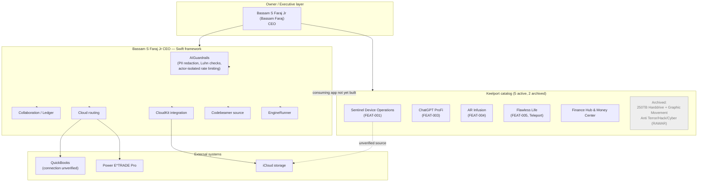

# Architecture diagram

© 2026 Bassam S Faraj Jr, also known as Bassam Faraj. All rights reserved.

Prepared October 1, 2026. Working architecture reference built from `executive-arsenal/MASTER-WORK-REGISTER.md` (Sept 25) and `executive-arsenal/README.md` (Sept 17). This is a documentation aid, not a certified system design, security architecture review, or proof that every box below is deployed and running.

## System map

## Layer notes

| Layer | Status | Evidence |
|---|---|---|
| Owner / Executive | Active | Workspace and IP registers attributed to Bassam S Faraj Jr. |
| Core framework | Buildable, tested | Swift 6 package build succeeded; 10–27 automated tests passed across suites (see `ENGINEERING_REVIEW.md`). No consuming application exists yet. |
| Catalog products | Mixed | Keelport lists seven projects: five active, two archived. "Live" is catalog metadata, not proof of a tested deployment. |
| External systems | Unverified | QuickBooks lookup returned "temporarily unavailable"; Power E*TRADE Pro requires sign-in; Sentinel source files are iCloud placeholders only. |

## Known architecture gaps

1. The Core framework has no consuming application; it is a library plus unit tests.
2. Sentinel's device-telemetry source is not locally downloaded — only placeholders exist.
3. ChatGPT ProFi, AR Infusion, and Flawless Life have catalog entries but no runnable build identified.
4. The Xcode scheme (per `ENGINEERING_REVIEW.md`) still references four stale package products (Algorithms, Numerics, RealModule, ComplexModule) blocking an Xcode build even though the Swift package build is clean.

See [PRODUCT-FOOTPRINT-MAP.md](./PRODUCT-FOOTPRINT-MAP.md), [BLUEPRINTS.md](./BLUEPRINTS.md), [STORYBOARDS.md](./STORYBOARDS.md), and [ROADMAP.md](./ROADMAP.md) for the companion artifacts.
