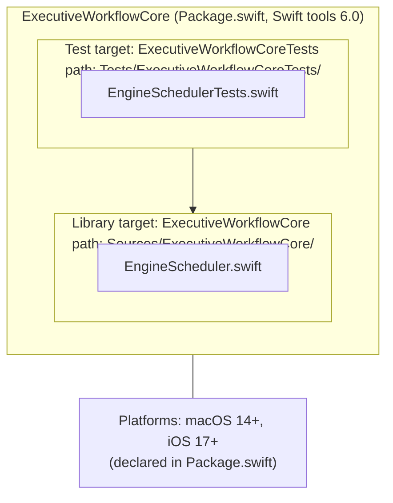
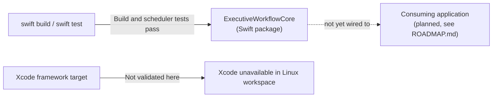

# Blueprints

© 2026 Bassam S Faraj Jr, also known as Bassam Faraj. All rights reserved.

Prepared October 1, 2026. Technical blueprint of the `ExecutiveWorkflowCore` Swift package (per `Package.swift`) and its current source modules. This is a structural reference, not a security certification or proof of production readiness.

## Package blueprint

## Module responsibility blueprint

| Module | Responsibility (inferred from file name / register) |
|---|---|
| `EngineScheduler.swift` | Validates dependency graphs; returns eligible work in release-target/priority order; tracks running and released engines with early/on-time/late results |

## Build blueprint (known-good path)

**Known-good:** `swift build` and `swift test` at the package root succeed on the available Swift 6.4 Linux toolchain. The package declares macOS 14+ and iOS 17+; Apple-platform builds still require Xcode validation.
**Xcode status:** the checked-in Xcode project is not wired to this Swift package. It needs to be integrated and built with Xcode on macOS before Apple-platform readiness can be confirmed.

## Blueprint for next construction phase

1. Integrate the package into the Xcode project and validate the framework/test targets on macOS.
2. Re-run the Xcode scheme build and test plan on macOS.
3. Design and implement the consuming application (daily priorities, delegation, decision follow-up) described in [STORYBOARDS.md](./STORYBOARDS.md).
4. Add persistence, authenticated private sharing, access controls, and integration tests before offering team workspaces.

See [ARCHITECTURE-DIAGRAM.md](./ARCHITECTURE-DIAGRAM.md), [PRODUCT-FOOTPRINT-MAP.md](./PRODUCT-FOOTPRINT-MAP.md), [STORYBOARDS.md](./STORYBOARDS.md), and [ROADMAP.md](./ROADMAP.md).
