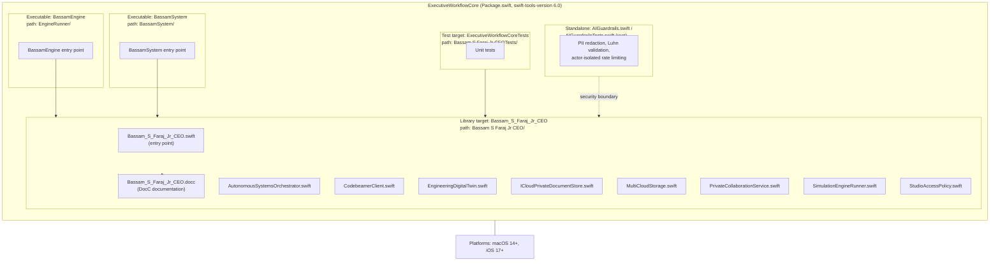
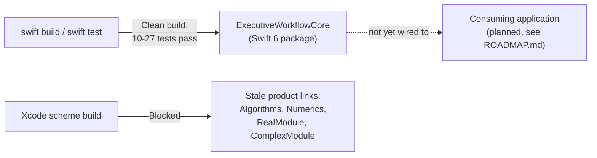

# Blueprints

© 2026 Bassam S Faraj Jr, also known as Bassam Faraj. All rights reserved.

Prepared October 1, 2026. Technical blueprint of the `ExecutiveWorkflowCore` Swift package (per `Package.swift`) and its real source modules. This is a structural reference, not a security certification or proof of production readiness — see `ENGINEERING_REVIEW.md` for the audited score (82/100).

## Package blueprint

## Module responsibility blueprint

| Module | Responsibility (inferred from file name / register) |
|---|---|
| `Bassam_S_Faraj_Jr_CEO.swift` | Package entry point / namespace root |
| `AutonomousSystemsOrchestrator.swift` | Orchestration of autonomous/automated workflow steps |
| `CodebeamerClient.swift` | Integration client for Codebeamer (ALM/requirements system) |
| `EngineeringDigitalTwin.swift` | Digital-twin representation of engineering state |
| `ICloudPrivateDocumentStore.swift` | Private document persistence via iCloud |
| `MultiCloudStorage.swift` | Cloud-routing abstraction across multiple storage backends |
| `PrivateCollaborationService.swift` | Collaboration / ledger service referenced in the Master Work Register |
| `SimulationEngineRunner.swift` | Simulation engine execution, consumed by `BassamEngine` |
| `StudioAccessPolicy.swift` | Access-control policy for studio/workspace resources |
| `AIGuardrails.swift` (root) | Shared safety layer: PII redaction, payment-card Luhn checks, rate limiting |

## Build blueprint (known-good path)

**Known-good:** `swift build` and `swift test` at the package root succeed and pass automated tests.
**Blocker:** the Xcode scheme still references four unused package products that must be removed (or re-justified) before the Xcode target builds — tracked in `ENGINEERING_REVIEW.md`.

## Blueprint for next construction phase

1. Remove/replace the four stale Xcode package references (Algorithms, Numerics, RealModule, ComplexModule).
2. Re-run the Xcode scheme build and test plan.
3. Design and implement the consuming application (daily priorities, delegation, decision follow-up) described in [STORYBOARDS.md](./STORYBOARDS.md).
4. Add integration tests against a real model provider and its moderation layer before presenting `AIGuardrails` as a complete safety system.
5. Route product-specific content policy and redaction rules through privacy/security/legal/trust-and-safety review.

See [ARCHITECTURE-DIAGRAM.md](./ARCHITECTURE-DIAGRAM.md), [PRODUCT-FOOTPRINT-MAP.md](./PRODUCT-FOOTPRINT-MAP.md), [STORYBOARDS.md](./STORYBOARDS.md), and [ROADMAP.md](./ROADMAP.md).
