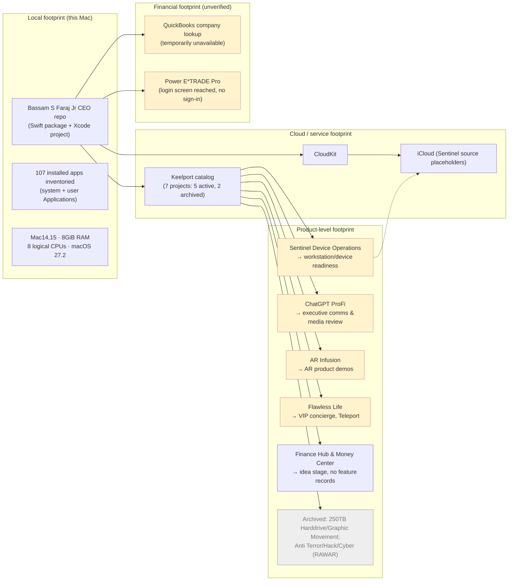

# Product footprint map

© 2026 Bassam S Faraj Jr, also known as Bassam Faraj. All rights reserved.

Prepared October 1, 2026. This maps each known product/asset to its footprint — platform, data surfaces, and real-world touchpoints — drawn from `executive-arsenal/MASTER-WORK-REGISTER.md` and `executive-arsenal/README.md`. Footprints marked "unverified" are catalog descriptions, not confirmed deployments.

## Footprint diagram

Yellow = catalog/claimed footprint pending verification. Grey = archived, excluded from active offerings.

## Footprint table

| Product / asset | Footprint type | Confirmed surface | Unverified / missing |
|---|---|---|---|
| Bassam S Faraj Jr CEO framework | Local + source | Swift package builds; tests pass; guardrails, ledger, cloud-routing, CloudKit, Codebeamer source present | No consuming application target |
| Sentinel Device Operations | Device telemetry (claimed) | Catalog entry, FEAT-001 requested | Source files are iCloud placeholders; no real server controls found |
| ChatGPT ProFi | Executive comms / media | Product brief exists | No feature records or runnable source supplied |
| AR Infusion | AR hardware/software | Project exists in catalog | No description, platforms, features, or source |
| Flawless Life | Concierge / events / digital delivery | Teleport (FEAT-001-equivalent) requested | No providers or fulfillment evidence located |
| Finance Hub & Money Center | Financial services | Catalog says "live" | No deployment or financial-data source located |
| QuickBooks connection | Accounting data | Lookup attempted | Server temporarily unavailable; no amounts/dates verified |
| Power E*TRADE Pro | Brokerage data | App opened, login screen reached | No sign-in performed; balances/holdings unverified |
| Archived: 250TB Harddrive w/ Graphic Movement | Storage/media | Historical record only | On hold; no active scope |
| Archived: Anti Terror/Hack/Cyber (RAWAR) | Security product | Historical record only | On hold; no active scope |

See [ARCHITECTURE-DIAGRAM.md](./ARCHITECTURE-DIAGRAM.md), [ROADMAP.md](./ROADMAP.md), [BLUEPRINTS.md](./BLUEPRINTS.md), and [STORYBOARDS.md](./STORYBOARDS.md).
