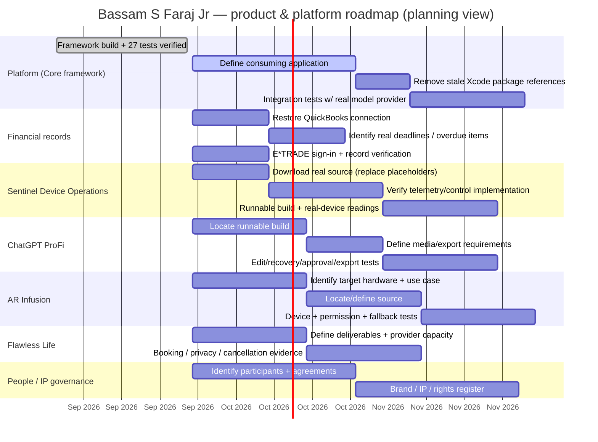

# Roadmap

© 2026 Bassam S Faraj Jr, also known as Bassam Faraj. All rights reserved.

Prepared October 1, 2026. Derived from the "Execution order" and "Work by category" sections of `executive-arsenal/MASTER-WORK-REGISTER.md` and the qualification sequence in `executive-arsenal/README.md`. Dates are planning targets, not commitments or completion claims.

## Roadmap diagram

## Phased roadmap table

| Phase | Priority | Focus | Exit criteria |
|---|---|---|---|
| 1 | P1 | Core framework → consuming app | Defined app + integration acceptance criteria passing |
| 1 | P1 | Money owed / repayments | Reconnected accounting or located invoice/contract records; verified settlement |
| 2 | P2 | CEO daily priorities app | Restart, authorization, delegation, failed-save tests passing |
| 2 | P2 | Local Mac hardware | Repeatable before/after timings for a specific slow workflow |
| 2 | P2 | Other devices | Device roster + benchmark + acceptance result |
| 2 | P2 | Sentinel Device Operations | Runnable build + timestamped real-device readings |
| 2 | P2 | ChatGPT ProFi | Version-specific edit/recovery/approval/export tests |
| 2 | P2 | AR Infusion | Actual-device tracking, permission, fallback, asset verification |
| 2 | P2 | Flawless Life | Booking, privacy, cancellation, fulfillment evidence |
| 2 | P2 | Finance Hub & Money Center | Deployment located + reconciled, evidenced transactions |
| 2 | P2 | People / partners | Accepted assignments, signed terms, completed deliverables |
| 3 | P3 | Brands / IP / media | Approved assets + documented usage rights |
| 3 | P3 | Personal administration | Task-specific receipts/confirmations |
| 3 | P3 | Private backend / service integration | Successful authenticated integration + access-boundary tests |
| 3 | P3 | Reusable workflow skill | Validated discoverable SKILL.md + replayed outcome |
| Hold | — | Archived: 250TB Harddrive/Graphic Movement; Anti Terror/Hack/Cyber (RAWAR) | Reactivation request + defined scope before resuming |

## Execution order (unchanged from Master Work Register)

1. Framework build and tests are verified → implement a defined consuming application and validate real integrations.
2. Restore access to receivable records and identify real deadlines → prioritize verified overdue obligations.
3. Retrieve missing source and select a concrete release deliverable for each active product.
4. Assign named owners and deadlines using the actual partner roster.
5. Qualify each release against acceptance criteria before marking it complete or offering it to customers.

See [ARCHITECTURE-DIAGRAM.md](./ARCHITECTURE-DIAGRAM.md), [PRODUCT-FOOTPRINT-MAP.md](./PRODUCT-FOOTPRINT-MAP.md), [STORYBOARDS.md](./STORYBOARDS.md), and [BLUEPRINTS.md](./BLUEPRINTS.md).
