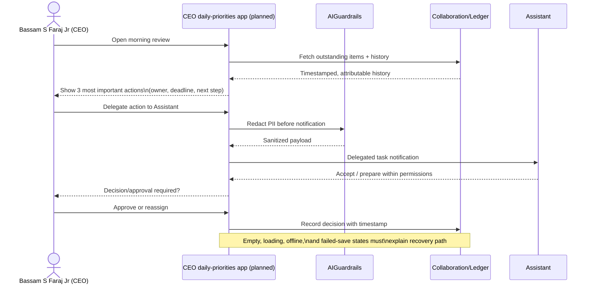
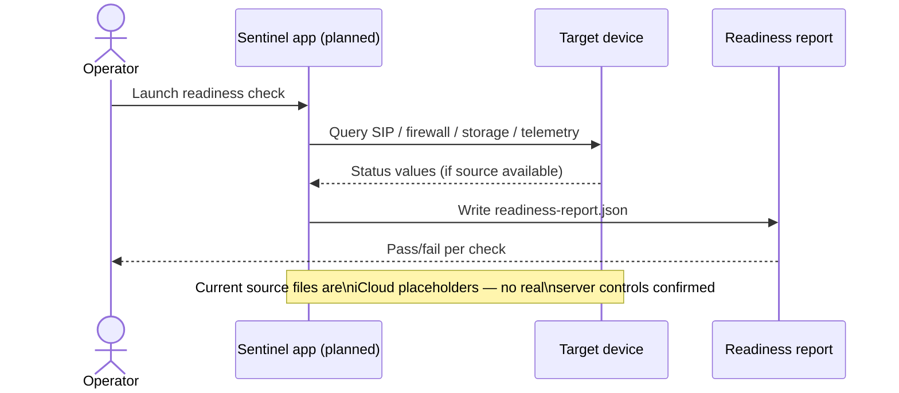
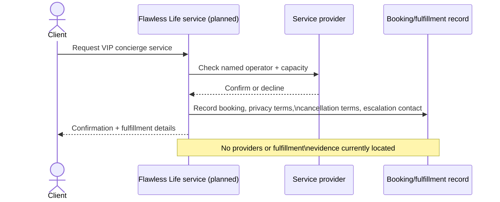

# Storyboards

© 2026 Bassam S Faraj Jr, also known as Bassam Faraj. All rights reserved.

Prepared October 1, 2026. These storyboards describe the intended executive workflow and two flagship product flows, based on the operating standard in `executive-arsenal/README.md` and the feature catalog in `executive-arsenal/MASTER-WORK-REGISTER.md`. They are design storyboards for planning, not records of a completed, tested experience.

## Storyboard 1 — Executive daily workflow (CEO framework)

### Frame-by-frame

1. **Open** — CEO opens the daily overview; empty/loading/offline states must explain what happened and how to recover.
2. **Review** — the three most important actions are shown, each with an owner, deadline, and next step.
3. **Delegate** — assistants prepare and act within their permissions; executive decisions and publication require the authorized role.
4. **Decide** — every decision, approval, reassignment, and fulfillment is timestamped with attributable history.
5. **Recover** — drafts survive recoverable errors; notifications contain only necessary information.

Status: **not yet built** — the Core framework currently has no consuming application; this storyboard is the target experience, per the Master Work Register.

## Storyboard 2 — Sentinel Device Operations (readiness check)

Status: **blocked** — inspected Sentinel source files remain iCloud placeholders; only a starter loading-screen test exists.

## Storyboard 3 — Flawless Life concierge booking (Teleport feature)

Status: **requested, not implemented** — FEAT-005 and Teleport are requested features with no provider roster or fulfillment evidence yet.

See [ARCHITECTURE-DIAGRAM.md](./ARCHITECTURE-DIAGRAM.md), [PRODUCT-FOOTPRINT-MAP.md](./PRODUCT-FOOTPRINT-MAP.md), [ROADMAP.md](./ROADMAP.md), and [BLUEPRINTS.md](./BLUEPRINTS.md).
